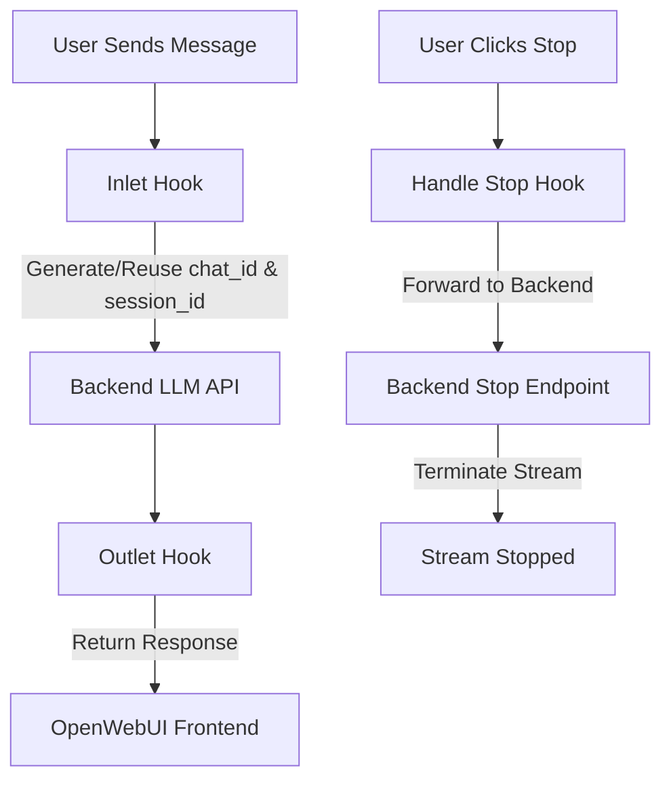

# Chat ID Tracker & Stream Manager Filter for OpenWebUI
This filter adds automatic *`chat_id`**, *`session_id`**, and **stream management** to OpenWebUI chat requests. It helps maintain conversation continuity and provides robust stop functionality for streaming responses.
---
## ✨ Features
- ✅ **Automatic Chat ID Management**: Generates unique `chat_id` for new conversations, reuses for continuations
- ✅ **Session Tracking**: Creates timestamp-based `session_id` for each chat session
- ✅ **Stream Stop Handling**: Intercepts stop signals and forwards to your backend API
- ✅ **Conversation Continuity**: Maintains context across multiple messages using message hashing
- ✅ **Backend Integration**: Works seamlessly with your LLM backend API
- ✅ **Debug Logging**: Comprehensive logging for easy troubleshooting
- ✅ **Customizable**: Easy to modify UUIDs, timestamps, and backend endpoints
---
## 📂 Installation
1. **Copy the filter code** from `open_web_ui_pipe.py`
2. **Navigate to your OpenWebUI admin**: `http://your-url:port/admin/functions`
3. **Create a new pipeline function** and paste the code
4. **Configure backend settings** in the filter valves:
   ```python
   backend_url: str = Field(default="http://host.docker.internal:8081")
   stop_endpoint: str = Field(default="/stop")
   ```
5. **Enable the filter** in your pipeline
6. **Ensure your backend** implements the `/stop` endpoint

---
## 🛠️ Usage
### Basic Chat Request Processing
Every request to `/chat/completions` will automatically include:
```python
# Request body will contain:
chat_id = body.get("chat_id")        # Unique conversation identifier
session_id = body.get("session_id")  # Session timestamp identifier
```
### FastAPI Backend Example
```python
from fastapi import FastAPI, Request
import json
app = FastAPI()
@app.post("/chat/completions")
async def chat(request: Request):
    # Access raw body with chat_id and session_id
    raw_body = await request.body()
    body = json.loads(raw_body.decode(errors="ignore"))
    chat_id = body.get("chat_id")
    session_id = body.get("session_id")
    print(f"Chat ID: {chat_id}, Session ID: {session_id}")
    # Your LLM processing logic here
    return {"response": "Processed", "chat_id": chat_id, "session_id": session_id}
```

### Stop Request Handling
When users click "Stop" in OpenWebUI, the filter:
1. Receives the stop signal with `session_id`
2. Forwards to your backend: `POST http://your-backend/stop`
3. Sends payload: `{"session_id": "session-1234567890", "chat_id": "uuid-here"}`

---
## 📊 Request Flow


---
## 🔧 Configuration
### Valve Settings
Customize the filter behavior:
```python
class Valves(BaseModel):
    priority: int = Field(default=0)  # Execution priority
    backend_url: str = Field(default="http://host.docker.internal:8081")
    stop_endpoint: str = Field(default="/stop")  # Your stop endpoint
```
### Backend Requirements
Your backend must implement:
1. **Chat endpoint**: `/v1/chat/completions` (or your configured endpoint)
2. **Stop endpoint**: `/stop` that accepts:
   ```json
   {
     "session_id": "session-1234567890",
     "chat_id": "uuid-string-here"
   }
   ```

---
## 🎨 Customization
### Modify Hashing Logic
Change how conversations are identified:
```python
def _hash_user_messages(messages: list) -> str:
    # Custom hashing logic here
    return custom_hash
```
### Add Persistence
Store conversations in database instead of memory:
```python
def save_conversation_store(self):
    # Save to database or file
    pass
```

---
## 🐛 Debugging
### Enable Detailed Logging
Add debug statements to monitor flow:
```python
print(f"Conversation hash: {conv_hash}, Chat ID: {body['chat_id']}")
print(f"Session ID: {session_id}, Active: {self._active_streams[session_id]['active']}")
```
### Test with Curl
```bash
curl -X POST http://localhost:8081/chat/completions \
  -H "Content-Type: application/json" \
  -d '{"messages": [{"role": "user", "content": "Hello"}]}'
```

---
## 📋 API Reference
### Inlet Method
```python
def inlet(self, body: dict, **user**: Optional[dict] = None) -> dict:
    # Processes incoming requests, adds chat_id/session_id
```
### Outlet Method
```python
def outlet(self, body: dict, **user**: Optional[dict] = None) -> dict:
    # Processes outgoing responses, cleans up sessions
```
### Stop Handler
```python
async def handle_stop(self, session_id: str, **user**: Optional[dict] = None) -> dict:
    # Handles stop requests from OpenWebUI
```

---
## 🚀 Performance Tips
1. **Use Redis**: For distributed conversation storage
2. **Add Caching**: Cache frequent conversation hashes
3. **Optimize Hashing**: Use faster hashing algorithms if needed
4. **Monitor Memory**: Watch `_conversation_store` size

---
## 🔒 Security Considerations
1. **Validate Inputs**: Sanitize chat_id and session_id values
2. **Rate Limiting**: Add limits to stop requests
3. **Authentication**: Verify backend API access
4. **Log Sensitive Data**: Avoid logging personal information

---
## 🌐 Multi-Instance Deployment
For production deployments:
1. **Shared Storage**: Use Redis for `_conversation_store`
2. **Distributed Locking**: Implement locking for concurrent access
3. **Load Balancing**: Ensure sticky sessions for conversation continuity

---
## 📝 Example Scenarios
### New Conversation
```python
# First message: generates new chat_id and session_id
{"chat_id": "new-uuid-1", "session_id": "session-1234567890"}
```
### Conversation Continuation
```python
# Subsequent message: reuses existing chat_id
{"chat_id": "existing-uuid-1", "session_id": "session-1234567890"}
```
### Stream Stop
```python
# Stop request: terminates active stream
{"status": "success", "message": "Stream stopped"}
```

---
## 🧑‍💻 Author
* **gangAI Team**
* **GitHub**: [@tomvsndev](https://github.com/tomvsndev)
* Inspired by OpenWebUI's extensible filter system

---
## 📄 License
This project is open source and available under the MIT License.
---
## ❓ Support
For issues and questions:
1. Check OpenWebUI logs for filter execution details
2. Verify backend API endpoints are accessible
3. Test with simple curl commands before UI integration
4. Review the debug logging output
---
## 🎯 Conclusion
This filter enhances OpenWebUI by providing:
- Robust conversation tracking
- Stream management capabilities
- Seamless backend integration
- Easy customization options
Perfect for building intelligent chat applications with OpenWebUI as your frontend and your custom API as the backend!
**Happy coding! 🚀**
  
Note: For full experience use gangAI-MCP-SERVER + openwebui-chat-id-pipe

Want to join:
Contact us : tomvsndev@gmail.com


 
